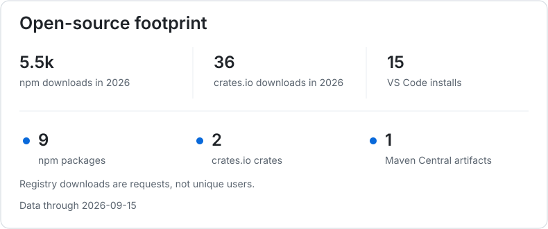
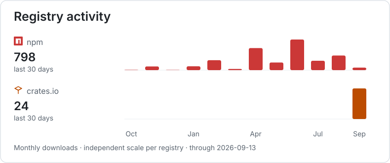

# Hello, I'm JF 👋

Backend engineer and occasional software architect, building pragmatic systems.

I build things I use, or wish existed, and keep the repositories open in case they are useful to someone else.

I work with coding agents as part of my day-to-day development workflow, mainly through OpenCode, and I build tools around that workflow too.

  

- 🏜️ Based in **Almería, Spain**
- 🚀 Co-founder at [Hexacode](https://hexacode.es)
- 💻 Usually somewhere between backend systems, software architecture and developer tooling
- 🎮 Outside code: Age of Empires II and FIBA basketball

## Core stack

         

Also working with Python, GitHub Actions, Prometheus, Grafana, Terraform, Kubernetes and Cloudflare. Still trying to find excuses to build things in Go.

*Small tools, disproportionate joy: jq, regex and automating the repetitive bits.*

## Projects

### Backend libraries

- **[PID Rate Limiter](https://github.com/jfrz38/rate-limit-pid-controller)** · `TypeScript` `Express` `NestJS` · Adaptive rate limiting driven by a PID feedback loop, inspired by [Uber's Cinnamon](https://www.uber.com/en-ES/blog/cinnamon-using-century-old-tech-to-build-a-mean-load-shedder/). [core](https://www.npmjs.com/package/@jfrz38/pid-controller-core) · [Express](https://www.npmjs.com/package/@jfrz38/pid-controller-express) · [NestJS](https://www.npmjs.com/package/@jfrz38/pid-controller-nestjs)
- **[NestJS Cache Proxy](https://github.com/jfrz38/nestjs-cache-proxy)** · `TypeScript` `NestJS` `cache-manager` · Transparent, declarative caching for NestJS providers without changing how consumers use them. [npm](https://www.npmjs.com/package/@jfrz38/nestjs-cache-proxy)
- **[mockguard](https://github.com/jfrz38/mockguard)** · `Kotlin` `JUnit 5` `Mockito` · Strict mock validation that detects interactions left unverified. [Maven Central](https://central.sonatype.com/artifact/io.github.jfrz38/mockguard)
- **[NestJS OpenAPI Wrapper](https://github.com/jfrz38/nestjs-openapi-generator-wrapper)** · `TypeScript` `NestJS` `OpenAPI` · Opinionated NestJS structures and templates on top of OpenAPI Generator. [npm](https://www.npmjs.com/package/@jfrz38/nestjs-open-api-generator-wrapper)

### Developer tooling & automation

- **[Clean Architecture Highlighter](https://github.com/jfrz38/clean-architecture-highlighter)** · `TypeScript` `VS Code` `ESLint` · Architecture dependency rules in the editor, linter and command line. [CLI](https://www.npmjs.com/package/@jfrz38/clean-architecture-highlighter-cli) · [ESLint](https://www.npmjs.com/package/@jfrz38/eslint-plugin-clean-architecture-highlighter) · [VS Code](https://marketplace.visualstudio.com/items?itemName=jfrz38.clean-architecture-highlighter)
- **[check-version-change](https://github.com/jfrz38/check-version-change)** · `TypeScript` `GitHub Actions` · Detects version changes across npm, PyPI, Maven, crates.io, Go modules and Git refs.
- **[auto-version-bump-action](https://github.com/jfrz38/auto-version-bump-action)** · `TypeScript` `GitHub Actions` · Reusable SemVer bumps for Gradle, npm and custom project files.
- **[cocommit](https://github.com/jfrz38/cocommit)** · `Rust` `ratatui` `Git` · A keyboard-driven TUI for building Conventional Commits. [crates.io](https://crates.io/crates/cocommit)

### OpenCode workflow

- **[OpenCode Copy Last](https://github.com/jfrz38/opencode-copy-last)** · `TypeScript` `OpenCode` · Copies the latest response or exchange without leaving the terminal. [npm](https://www.npmjs.com/package/@jfrz38/opencode-copy-last)
- **[OpenCode Wololo Notifications](https://github.com/jfrz38/opencode-wololo-notifications)** · `TypeScript` `OpenCode` · Configurable Age of Empires II sounds for agent events. [npm](https://www.npmjs.com/package/@jfrz38/opencode-wololo-notifications)

### Experiments & side quests

- **[smart-world-map](https://github.com/jfrz38/smart-world-map)** · `Python` `Rust` `Arduino` · A physical LED map following the ISS, nearby flights and earthquakes.
- **[worldhunt](https://github.com/jfrz38/worldhunt)** · `Rust` `ratatui` · An offline hot-and-cold country guessing game for the terminal. [crates.io](https://crates.io/crates/worldhunt)
- **[wololang](https://github.com/jfrz38/wololang)** · `TypeScript` `esolang` · An esoteric language built from Age of Empires II taunts. Yes, `wololo` is valid syntax.
- **[rocket-api-test](https://github.com/jfrz38/rocket-api-test)** · `Rust` `Rocket` · A deliberately small API exploring layered design, dependency inversion and value objects.

[Browse all repositories →](https://github.com/jfrz38?tab=repositories)

## Packages in the wild

Registry requests are not unique users, but they are a useful pulse of where these tools travel.

  <picture>
    <source media="(prefers-color-scheme: dark)" srcset="./profile/distribution-dark.svg">
    <source media="(prefers-color-scheme: light)" srcset="./profile/distribution-light.svg">
    
  </picture>

  <picture>
    <source media="(prefers-color-scheme: dark)" srcset="./profile/registry-activity-dark.svg">
    <source media="(prefers-color-scheme: light)" srcset="./profile/registry-activity-light.svg">
    
  </picture>

## GitHub snapshot

*Public repositories only.*

  <picture>
    <source media="(prefers-color-scheme: dark)" srcset="./profile/stats-dark.svg">
    <source media="(prefers-color-scheme: light)" srcset="./profile/stats-light.svg">
    
  </picture>

  <picture>
    <source media="(prefers-color-scheme: dark)" srcset="./profile/top-langs-dark.svg">
    <source media="(prefers-color-scheme: light)" srcset="./profile/top-langs-light.svg">
    
  </picture>

---

🔥 **Coding like I play AoE II:** *stressful and crying*

